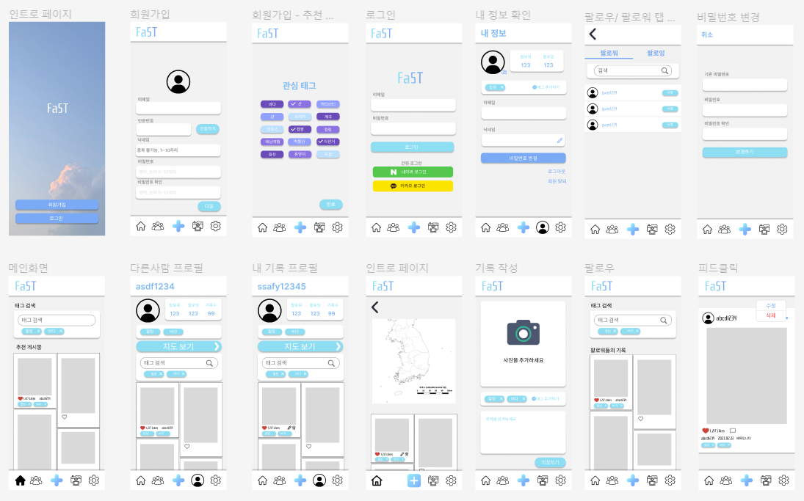

# FaST (스마트 여행기록 SNS)

### Fast and Smart Travel✈️

## 📺 시연 영상
https://youtu.be/T1_tlWxepn8

 

## 1. 프로젝트 진행 기간

📅 2023.02.27(월) ~ 2023.04.07(금)  

 

## 2. 서비스 기획 배경

어디로 여행을 갔었는지 기억이 잘 나시나요?  
여행 사진을 찾아보려면 핸드폰 사진첩에서 꽤 오랜 시간이 걸리진 않으신가요?  
여행 사진을 올리면 AI 예측 모델을 통해 여행지를 자동 태그해주고, 태그와 지역별로 모아볼 수 있는 여행기록 SNS FaST 입니다. 

 

## 3. 서비스 개요

✅ 본인이 다녀온 여행지에 대해 사진과 글로 기록 
✅ ResNet101+ArcFace로 전국의 랜드마크를 학습시켜 예측모델 구축. 
✅ 예측모델로 랜드마크를 인식해 자동태그를 생성 
✅ 관심태그별로 게시글을 조회 
✅ 팔로우, 팔로잉 기능을 통해 친구 간의 게시물을 확인. 
✅ 기록한 태그 및 관심 태그 기반 여행지 게시물 추천 

 

## 4. 기술스택

### FrontEnd

| 
 
 | 

 | 

 |
| :-----------------------------------------------------------------------------------------------------: | :--------------------------------------------------------------------------------------------------: | :-------------------------------------------------------------------------------------------------------: |
|HTML5|CSS3 | TypeScript|

| 
 
 | 
 
 | 
 
 | 
 
 |
| :----------------------------------------------------------------------------------------------------: | :----------------------------------------------------------------------------------------------------: | -------------------------------------------------------------------------------------------------------- | ----------------------------------------------------------------------------------------------------------------- |
|React|Node.js|Recoil| Sass |

### BackEnd & AI

| 
 
 | 
 
 | 

 | 

 | 

 |
| :----------------------------------------------------------------------------------------------------: | :-----------------------------------------------------------------------------------------------------------------: | :------------------------------------------------------------------------------------------------------------------------: | :-------------------------------------------------------------------------------------------------------: | :-------------------------------------------------------------------------------------------------------------: |
| Java  | Spring-Boot |Spring-Security |Python|Flask|

| 
 
 | 

 | 

 | 

 |
| :------------------------------------------------------------------------------------------------------: | :---------------------------------------------------------------------------------------------------------: |:--------------------------------------------------------------------------------------------------------: | :-----------------------------------------------------------------------------------------------------: | 
| Mysql|  JPA  |Tensorflow | keras  | 

### DevOps
NginX Docker AWS EC2 jenkins
| 
 
 | 

 | 

 | 

 |
| :--------------------------------------------------------------------------------------------------------: | :-----------------------------------------------------------------------------------------------------: | :-------------------------------------------------------------------------------------------------: |:-----------------------------------------------------------------------------------------------: |
| Docker|NginX | AWS EC2 | Jenkins |

## 5. 시스템 구성도

## 6. 와이어프레임

*Figma 사용  

## 7. 팀원 소개

| 이름   | 역할 | 담당                                |
| ------ | ---- | ----------------------------------- |
| 이소민 | 팀장 | Frontend 개발 + 디자인  |
| 박세희 | 팀원 | Frontend 개발 + 디자인              |
| 고태진 | 팀원 | Frontend 개발 + CI/CD + 무중단배포            |
| 정다은 | 팀원 | Backend 개발 + AI 모델 학습 및 예측 모델 구축 |
| 오준호 | 팀원 | Backend 개발 + API 설계 및 관리    |

 

## 8. AI 모델 및 데이터
✈ <b>데이터셋([AI Hub 랜드마크 이미지](https://aihub.or.kr/aihubdata/data/view.do?currMenu=115&topMenu=100&dataSetSn=56))</b> - `서울`, `인천`, `경상북도`, `제주`, `부산` 지역 675개 랜드마크 학습  
✈<b>AI 모델</b>: RestNet101 + ArcFace 

📃 <b>[학습 기록 보러가기](https://clammy-opossum-12e.notion.site/FaST-a16de228d5544c0da9528aa06fa9c351)</b>

